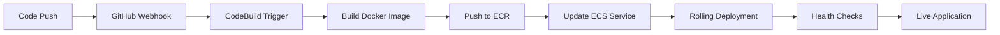

# Complete GitHub Integration Setup Guide

## Overview

This enhanced solution automatically pulls your private GitHub repositories, builds Docker images using AWS CodeBuild, and deploys them to ECS. Here's how it works:

```
GitHub Repos → CodeBuild → ECR → ECS → ALB → Your Users
```

## Architecture Benefits

✅ **ECS over EC2**: Uses AWS Fargate (serverless containers) instead of managing EC2 instances
✅ **Automated CI/CD**: Automatic builds triggered by code changes
✅ **Secure**: Private repositories accessed via SSH keys stored in AWS Secrets Manager
✅ **Scalable**: Auto-scaling based on demand
✅ **Cost-effective**: Pay only for what you use

## Step-by-Step Implementation

### Phase 1: Repository Preparation

#### 1.1 Add Dockerfiles to Your Repositories

**For adherelive-web (Backend) - Add this Dockerfile:**

```dockerfile
FROM node:18-alpine as builder

WORKDIR /usr/src/app

# Copy package files
COPY package*.json ./

# Install dependencies
RUN npm ci

# Copy source code
COPY . .

# Build if you have a build step (uncomment if needed)
# RUN npm run build

# Production stage
FROM node:18-alpine as production

WORKDIR /usr/src/app

# Copy package files
COPY package*.json ./

# Install only production dependencies
RUN npm ci --only=production && npm cache clean --force

# Copy application
COPY --from=builder /usr/src/app .

# Create non-root user
RUN addgroup -g 1001 -S nodejs && \
    adduser -S nodejs -u 1001

# Add health check endpoint to your app.js/index.js:
# app.get('/health', (req, res) => res.status(200).json({status: 'healthy'}));

RUN chown -R nodejs:nodejs /usr/src/app
USER nodejs

HEALTHCHECK --interval=30s --timeout=3s --start-period=5s --retries=3 \
  CMD node -e "const http=require('http');const options={host:'localhost',port:process.env.PORT||5000,path:'/health',timeout:2000};const req=http.request(options,(res)=>{process.exit(res.statusCode===200?0:1)});req.on('error',()=>process.exit(1));req.end();" || exit 1

EXPOSE 5000

CMD ["npm", "start"]
```

**For adherelive-fe (Frontend) - Add this Dockerfile:**

```dockerfile
FROM node:18-alpine as builder

WORKDIR /app

# Copy package files
COPY package*.json ./

# Install dependencies
RUN npm ci

# Copy source code
COPY . .

# Build the React application
RUN npm run build

# Production stage with Nginx
FROM nginx:alpine as production

# Copy built React app
COPY --from=builder /app/build /usr/share/nginx/html

# Add custom nginx config
RUN cat > /etc/nginx/nginx.conf << 'EOF'
events {
  worker_connections 1024;
}

http {
  include       /etc/nginx/mime.types;
  default_type  application/octet-stream;
  
  sendfile        on;
  keepalive_timeout  65;
  
  gzip on;
  gzip_vary on;
  gzip_min_length 1024;
  gzip_types text/plain text/css text/xml text/javascript application/javascript application/xml+rss application/json;
  
  server {
    listen       80;
    server_name  localhost;
    
    location / {
      root   /usr/share/nginx/html;
      index  index.html index.htm;
      try_files $uri $uri/ /index.html;
    }
    
    location /health {
      access_log off;
      return 200 "healthy\n";
      add_header Content-Type text/plain;
    }
    
    error_page   500 502 503 504  /50x.html;
    location = /50x.html {
      root   /usr/share/nginx/html;
    }
  }
}
EOF

# Add health check
RUN apk add --no-cache curl

HEALTHCHECK --interval=30s --timeout=3s --start-period=5s --retries=3 \
  CMD curl -f http://localhost/health || exit 1

EXPOSE 80

CMD ["nginx", "-g", "daemon off;"]
```

#### 1.2 Add Health Check Endpoints

**Backend (Express.js) - Add to your main app file:**

```javascript
// Add this health check route
app.get('/health', (req, res) => {
  res.status(200).json({ 
    status: 'healthy', 
    timestamp: new Date().toISOString(),
    uptime: process.uptime(),
    version: process.env.npm_package_version || 'unknown'
  });
});
```

#### 1.3 Add BuildSpec Files

Copy the `buildspec-backend.yml` and `buildspec-frontend.yml` files to the root of your respective repositories.

### Phase 2: AWS Setup

#### 2.1 Configure GitHub Access

```bash
# Make the setup script executable
chmod +x setup-github-integration.sh

# Run the GitHub integration setup
./setup-github-integration.sh
```

This script will:
- Generate SSH keys for GitHub access
- Store credentials in AWS Secrets Manager
- Provide instructions for adding keys to GitHub

#### 2.2 Update Terraform Configuration

Update your `terraform.tfvars`:

```hcl
# Repository Configuration
backend_repo_url   = "https://github.com/adherelive/adherelive-web.git"
frontend_repo_url  = "https://github.com/adherelive/adherelive-fe.git"
backend_branch     = "akshay-gaurav-latest-changes"
frontend_branch    = "akshay-gaurav-latest-changes"
image_tag          = "latest"

# Other configurations...
domain_name = "adhere.live"
subdomain   = "test"
```

### Phase 3: Infrastructure Deployment

#### 3.1 Deploy Infrastructure

```bash
# Initialize and deploy
./deploy-infrastructure.sh init
./deploy-infrastructure.sh plan
./deploy-infrastructure.sh apply
```

This creates:
- ECR repositories for your images
- CodeBuild projects for automated builds
- ECS cluster and services
- All networking and security components

#### 3.2 Initial Build

```bash
# Trigger initial builds manually
aws codebuild start-build --project-name adherelive-prod-backend-build --region ap-south-1
aws codebuild start-build --project-name adherelive-prod-frontend-build --region ap-south-1
```

### Phase 4: Automated Deployment

#### 4.1 Use the Automated Script

```bash
# Make executable
chmod +x build-and-deploy.sh

# Deploy latest changes
./build-and-deploy.sh prod akshay-gaurav-latest-changes

# Or with auto-confirmation
./build-and-deploy.sh prod akshay-gaurav-latest-changes --auto-yes
```

This script:
1. Triggers parallel builds for both repositories
2. Monitors build progress
3. Updates ECS services with new images
4. Verifies deployment health
5. Provides status summary

## Why ECS Over EC2?

### ECS Fargate Advantages:
- **No server management**: AWS manages the underlying infrastructure
- **Auto-scaling**: Scales containers based on demand automatically
- **Cost-effective**: Pay only for running containers
- **Better security**: Each task gets its own isolated environment
- **Integration**: Native integration with ALB, CloudWatch, Secrets Manager
- **Zero-downtime deployments**: Rolling updates with health checks

### Comparison:

| Feature | ECS Fargate | EC2 with Docker |
|---------|-------------|-----------------|
| Server Management | None | Full responsibility |
| Scaling | Automatic | Manual setup required |
| Security Patching | AWS managed | Your responsibility |
| Cost | Pay per container | Pay for full instances |
| Load Balancing | Native ALB integration | Manual configuration |
| Health Checks | Built-in | Custom implementation |
| Secrets Management | Native integration | Manual setup |

## Complete Workflow

### Development to Production Flow:



### Manual Deployment Process:

1. **Code Changes**: Push to `akshay-gaurav-latest-changes` branch
2. **Trigger Build**: Run `./build-and-deploy.sh`
3. **Monitor**: Watch build progress in real-time
4. **Automatic Deployment**: ECS picks up new images
5. **Verification**: Automated health checks confirm deployment

## Monitoring and Troubleshooting

### 1. Build Monitoring

```bash
# Monitor builds in real-time
aws logs tail /aws/codebuild/adherelive-prod-backend-build --follow

# Check build history
aws codebuild list-builds-for-project --project-name adherelive-prod-backend-build
```

### 2. Application Monitoring

```bash
# Check ECS service status
aws ecs describe-services --cluster adherelive-prod-cluster --services adherelive-prod-backend

# View application logs
aws logs tail /ecs/adherelive-prod-backend --follow

# Check health endpoints
curl https://test.adhere.live/health
curl https://test.adhere.live/api/health
```

### 3. Common Issues and Solutions

#### Build Failures
- **SSH Key Issues**: Verify SSH keys are added to GitHub deploy keys
- **Dockerfile Errors**: Check Dockerfile syntax and dependencies
- **Permission Issues**: Verify CodeBuild IAM role has ECR permissions

#### Deployment Issues
- **Health Check Failures**: Ensure `/health` endpoints return 200
- **Network Issues**: Check security group configurations
- **Resource Limits**: Monitor CPU/memory usage and adjust if needed

#### Performance Issues
- **Slow Response**: Check ALB target group health
- **High CPU**: Adjust auto-scaling parameters
- **Database Connections**: Monitor RDS connection count

## Security Considerations

### 1. GitHub Access
- SSH keys stored securely in AWS Secrets Manager
- Personal Access Token with minimal required permissions
- Deploy keys with read-only access to repositories

### 2. Container Security
- Non-root user in containers
- Multi-stage builds to reduce image size
- Regular security scanning via ECR
- Secrets injected via environment variables, not files

### 3. Network Security
- Private subnets for all application components
- Security groups with minimal required access
- VPC endpoints for AWS service communication
- SSL/TLS encryption everywhere

## Cost Optimization

### 1. Resource Right-sizing
```hcl
# Adjust in terraform.tfvars for your workload
backend_cpu    = 512   # For 100 users
backend_memory = 1024  # Adjust based on usage
frontend_cpu   = 256   # Static content serving
frontend_memory = 512  # Minimal for Nginx
```

### 2. Auto-scaling Configuration
```hcl
# Scale based on actual usage
auto_scaling_min_capacity = 1   # Minimum containers
auto_scaling_max_capacity = 10  # Maximum for traffic spikes
auto_scaling_target_cpu   = 70  # Scale at 70% CPU
```

### 3. Cost Monitoring
- Set up billing alerts for unexpected charges
- Use AWS Cost Explorer to track spending trends
- Consider Reserved Instances for RDS in production

## Scaling for Growth

### Current Setup (100 Users)
- **Backend**: 2 tasks × 512 CPU/1024 MB
- **Frontend**: 2 tasks × 256 CPU/512 MB
- **RDS**: db.t3.micro with auto-scaling storage
- **DocumentDB**: Single instance db.t3.medium

### Scaling to 500+ Users
```hcl
# Update terraform.tfvars
backend_desired_count     = 4
frontend_desired_count    = 3
auto_scaling_max_capacity = 20
rds_instance_class       = "db.t3.small"
documentdb_cluster_size  = 2
enable_multi_az          = true
```

### Scaling to 1000+ Users
- Implement caching layer (ElastiCache)
- Add CloudFront CDN for global distribution
- Consider Aurora Serverless for database
- Implement database read replicas
- Add monitoring and alerting

## Disaster Recovery

### Current DR Capabilities
- **Multi-AZ RDS**: Automatic failover within region
- **ECS**: Tasks distributed across availability zones
- **Automated Backups**: 7-day retention for databases
- **Infrastructure as Code**: Complete environment recreation

### Enhanced DR (Optional)
```hcl
# Enable in terraform.tfvars
enable_multi_az             = true
backup_retention_period     = 30
enable_cross_region_backup  = true
```

### DR Testing
```bash
# Simulate AZ failure
aws ecs update-service --cluster adherelive-prod-cluster \
  --service adherelive-prod-backend --desired-count 0

# Monitor recovery
aws ecs describe-services --cluster adherelive-prod-cluster \
  --services adherelive-prod-backend
```

## Maintenance and Updates

### 1. Regular Updates
- **Security patches**: Automatic OS updates in Fargate
- **Application updates**: Use the build-and-deploy script
- **Infrastructure updates**: Regular terraform apply

### 2. Database Maintenance
- **RDS**: Automated maintenance windows
- **DocumentDB**: Manual maintenance scheduling
- **Backup verification**: Regular restore testing

### 3. Monitoring Health
- **CloudWatch Alarms**: CPU, memory, response time
- **Log Analysis**: Error tracking and performance monitoring
- **Health Dashboards**: Real-time application status

## Next Steps After Deployment

### 1. Immediate (First Week)
- [ ] Monitor application performance and adjust resources
- [ ] Set up CloudWatch dashboards for key metrics
- [ ] Test auto-scaling behavior under load
- [ ] Verify backup and restore procedures

### 2. Short Term (First Month)
- [ ] Implement automated testing in CodeBuild
- [ ] Set up staging environment
- [ ] Add CloudFront CDN for better performance
- [ ] Implement comprehensive logging and monitoring

### 3. Long Term (3+ Months)
- [ ] Consider implementing blue-green deployments
- [ ] Add caching layer for improved performance
- [ ] Implement advanced security scanning
- [ ] Plan for international expansion if needed

## Conclusion

This architecture provides:
- **Scalability**: Handles 100+ concurrent users with room to grow
- **Reliability**: Multi-AZ deployment with automatic failover
- **Security**: Private networks, encrypted storage, secure secrets management
- **Maintainability**: Infrastructure as code with automated deployments
- **Cost-effectiveness**: Pay-per-use pricing with auto-scaling

The ECS Fargate approach eliminates server management overhead while providing enterprise-grade reliability and security for your AdhereLive application.